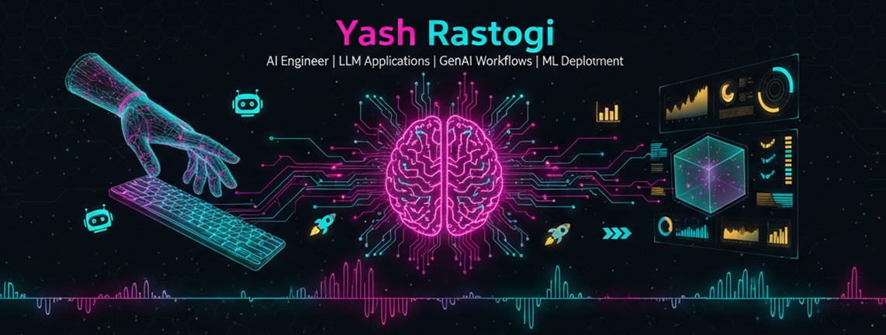

<!--
**ysrastogi/ysrastogi** is a ✨ _special_ ✨ repository because its `README.md` (this file) appears on your GitHub profile.

Here are some ideas to get you started:

- 🔭 I’m currently working on ...
- 🌱 I’m currently learning ...
- 👯 I’m looking to collaborate on ...
- 🤔 I’m looking for help with ...
- 💬 Ask me about ...
- 📫 How to reach me: ...
- 😄 Pronouns: ...
- ⚡ Fun fact: ...
-->

```md


# 👋 Hi, I'm Yash Rastogi  

💡 *AI Engineer | LLM Applications | GenAI Workflows | ML Deployment*  
🚀 Building next-gen AI apps, blending **creativity + engineering**.  
🎯 Kaggle aspirant | Hackathon finalist | Startup-ready builder  

---

## 🛠️ Tech Stack


---

## 🚀 Featured Projects  

### 🤖 Zenith AI Assistant  
> *RAG-powered LLM assistant with FastAPI + Pinecone.*  
🛠 Tech: Python, HuggingFace, FastAPI, Pinecone  
📊 [Repo](#) | 🎥 [Demo](#) | 📝 [Blog](#)  

---

### 🔒 CyberWatt Defender AI  
> *Embedding-powered CVE threat detection with transformers.*  
🛠 Tech: Python, HuggingFace, Transformers, Vector DB  
📊 [Repo](#) | 🎥 [Demo](#) | 📝 [Blog](#)  

---

### 📊 DataTest Pipeline Simulator  
> *Simulating PySpark & cloud-native pipelines for ML workflows.*  
🛠 Tech: PySpark, Docker, AWS, MLflow  
📊 [Repo](#) | 🎥 [Demo](#) | 📝 [Blog](#)  

---

### ⚡ AltoroJ CVE Scanner  
> *WordPress vulnerability detection with AI embeddings.*  
🛠 Tech: Python, FastAPI, Vector DBs  
📊 [Repo](#) | 🎥 [Demo](#) | 📝 [Blog](#)  

---

### 🏟️ Sports Betting Widget  
> *Custom live score & arbitrage system (football, tennis, volleyball).*  
🛠 Tech: Node.js, API Integration, FastAPI, WebSockets  
📊 [Repo](#) | 🎥 [Demo](#) | 📝 [Blog](#)  

---

## 📝 Latest Blog Posts  
<!-- GitHub Action can auto-update this section -->
- [Fine-Tuning LLMs on Domain Data](#)  
- [Building Data Pipelines with PySpark](#)  
- [Detecting CVEs with Transformers](#)  

---

## 📊 GitHub Stats  

  
  

---

## 🌐 Connect with Me  

[](#)  
[](#)  
[](#)  
[](#)  
```

